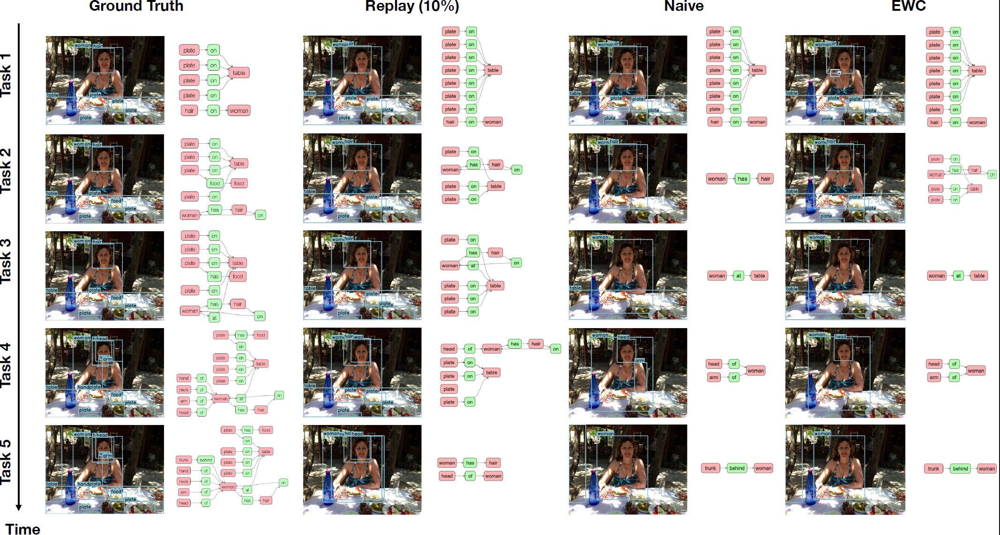
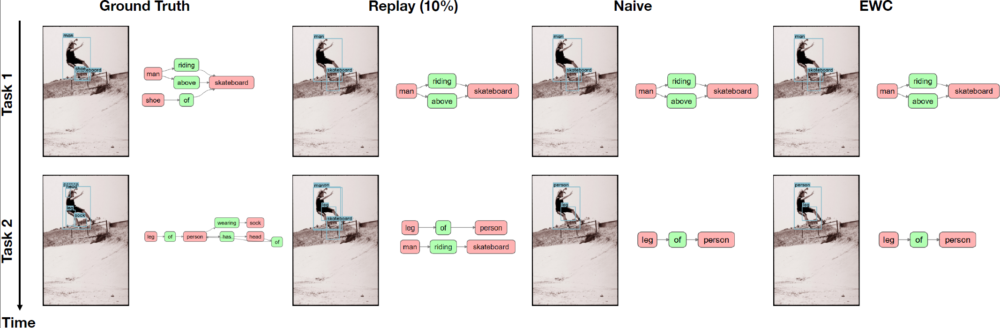
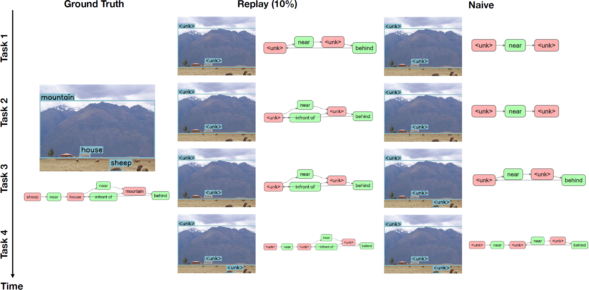

# Adaptive Visual Scene Understanding: Incremental Learning in Scene Graph Generation

Authors:- Naitik Khandelwal, Xiao Liu, Mengmi Zhang

This repository houses our CSEGG benchmark implementation, encompassing source code for experimenting with Transformer-based SGG methods across various continual learning algorithms in all proposed learning scenarios outlined in our paper. Additionally, it includes the code for data generation in all the scenarios presented in the paper.

## Project Description 

The project focuses on scene graph generation (SGG), which involves analyzing images to extract valuable information about objects and their relationships. In the dynamic visual world, it becomes crucial for AI systems to detect new objects and establish their relationships with existing objects. However, the field of SGG lacks continual learning methodologies. To address this gap, we introduce the comprehensive Continual ScenE Graph Generation (CSEGG) dataset, which includes three learning scenarios and six evaluation metrics. Our research aims to investigate the performance of existing SGG methods in continual learning, specifically regarding the retention of previous object entities and relationships while learning new ones. Furthermore, we explore how continual object detection enhances generalization in classifying known relationships on unknown objects. Some visualization examples our from all the scenarios are shown below.

  
   
  <em>Visualization examples for Learning Scenario 1.</em>

  
   
  <em>Visualization examples for Learning Scenario 2.</em>

  
   
  <em>Visualization examples for Learning Scenario 3.</em>

## Dataset

Check [DATASET.md](DATASET.md) for instructions of dataset preprocessing.

## Installation
Check [INSTALL.md](INSTALL.md) for installation instructions.

