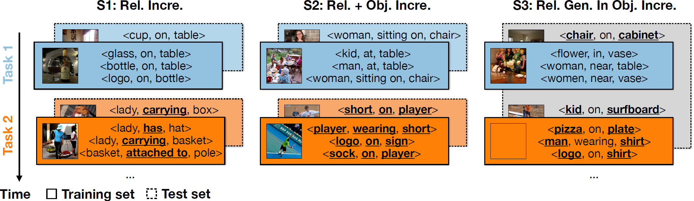

# Adaptive Visual Scene Understanding: Incremental Learning in Scene Graph Generation

[](LICENSE)
[](https://www.python.org/)
[](https://pytorch.org/get-started/previous-versions/)

Authors: Naitik Khandelwal, Xiao Liu, Mengmi Zhang

This repository houses our CSEGG benchmark implementation, encompassing source code for experimenting with Transformer-based SGG methods across various continual learning algorithms in all proposed learning scenarios outlined in our paper. Additionally, it includes the code for data generation in all the scenarios presented in the paper.

## Project Description 

The project focuses on scene graph generation (SGG), which involves analyzing images to extract valuable information about objects and their relationships. In the dynamic visual world, it becomes crucial for AI systems to detect new objects and establish their relationships with existing objects. However, the field of SGG lacks continual learning methodologies. To address this gap, we introduce the comprehensive Continual ScenE Graph Generation (CSEGG) dataset, which includes three learning scenarios and six evaluation metrics. Our research aims to investigate the performance of existing SGG methods in continual learning, specifically regarding the retention of previous object entities and relationships while learning new ones. Furthermore, we explore how continual object detection enhances generalization in classifying known relationships on unknown objects. 

Below is an illustration of all the learning scenarios in CSEGG:

| [](samples/illustration_learning_scenarios.png) | 
|:---:|
| CSEGG Learning Scenarios. |

From left to right, they are S1. relationship (Rel.) incremental learning (Incre.); S2. relationship and object (Rel. + Obj.) Incre.; and S3. relationship generalization (Rel. Gen.) in Object Incre.. In S1 and S2, example triplets in the training (solid line) and test sets (dash line) from each task are presented. The training and test sets from the same task are color-coded. The new objects or relationships in each task are bold and underlined. In S3, one single test set (dashed gray box) is used for benchmarking the relationship generalization ability of object incre. learning models across all the tasks.

<!--
Some visualization examples from all the scenarios are shown below.

| [](samples/viz_S1.png) | 
|:---:|
| Visualization examples for Learning Scenario 1. |

| [](samples/viz_S2.png) | 
|:---:|
| Visualization examples for Learning Scenario 2. |

| [](samples/viz_S3.png) | 
|:---:|
| Visualization examples for Learning Scenario 3. | -->

## Dataset

Check [DATASET.md](DATASET.md) for instructions of dataset preprocessing.

## Installation
Check [INSTALL.md](INSTALL.md) for installation instructions.

## Training and Evaluation

### Learning Scenario S1 

There is only Stage 2 training for Learning Scenario S1. To train the model, run the following in the command window:

```bash
cd ~/CSEGG/playground/sgg/detr.res101.c5.one_stage_rel_tfmer

pods_train_S1 --num-gpus 4 --continual "random_replay"

```
To evaluate,

```bash
cd ~/CSEGG/playground/sgg/detr.res101.c5.one_stage_rel_tfmer
pods_test_S1 --num-gpus 1 

```
### Learning Scenario S2 

To train the model, run the following in the command window:

```bash
#Stage 1
cd ~/CSEGG/playground/sgg/detr.res101.c5.multiscale.150e.bs16

pods_train_S2 --num-gpus 4 --continual "random_replay"
```

```bash
#Stage 2
cd ~/CSEGG/playground/sgg/detr.res101.c5.one_stage_rel_tfmer

pods_train_S2 --num-gpus 4 --continual "random_replay" --sgg "sgg"
```

To evaluate,

```bash
cd ~/CSEGG/playground/sgg/detr.res101.c5.one_stage_rel_tfmer
#Evaluation of Object Detection (Stage 1) and SGG (Stage 2) is combined
pods_test_S2 --num-gpus 1 

```

### Learning Scenario S3 

To train the model, run the following in the command window:

```bash
#Stage 1
cd ~/CSEGG/playground/sgg/detr.res101.c5.multiscale.150e.bs16

pods_train_S3 --num-gpus 4 --continual "random_replay"
```

```bash
#Stage 2
cd ~/CSEGG/playground/sgg/detr.res101.c5.one_stage_rel_tfmer

pods_train_S3 --num-gpus 4 --continual "random_replay" --sgg "sgg"
```

To evaluate,

```bash
#evaluation of R_bbox and R@k_relation_gen
cd ~/CSEGG/playground/sgg/detr.res101.c5.one_stage_rel_tfmer
pods_test_S3 --num-gpus 1 

```

## Acknowledgment
This repository borrows code from scene graph benchmarking frameworks: [Scene Graph Benchmark](https://github.com/KaihuaTang/Scene-Graph-Benchmark.pytorch) developed by KaihuaTang, [PySGG](https://github.com/SHTUPLUS/PySGG) and [SGTR](https://github.com/Scarecrow0/SGTR/tree/main) developed by Rongjie Li.


